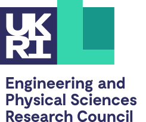

## Organizing Committee

- [Bahar Irfan](https://www.baharirfan.com/), *EKTH Royal Institute of Technology (Sweden), birfan@kth.se*. 

Bahar Irfan is a Postdoctoral Researcher and Digital Futures fellow at KTH Royal Institute of Technology. Her research focuses on creating personal robots that can continually learn and adapt to assist in everyday life. Previously, she was a Research and Development Associate at Evinoks Service Equipment Industry and Commerce Inc., developing customizable software for industrial robots, virtual reality applications, and smart buffets. Prior to that, she worked as an R&D Lab Associate at Disney Research Los Angeles on emotional language adaptation in multiparty interactions.
She has a diverse background in robotics, from personalization in long-term human-robot interaction during her PhD at the University of Plymouth and SoftBank Robotics Europe as a Marie Skłodowska-Curie Actions fellow to user-centred task planning for household robotics during her MSc in computer engineering, and building robots for BSc in mechanical engineering at Boğaziçi University.

- [Aditi Ramachandran](http://www.aditiramachandran.com/), *Vän Robotics (USA), aditi@myvanrobot.com*

Aditi Ramachandran is the Chief Robot Officer at Vän Robotics where she works on building educational robots and oversees all software development at the company. She received a PhD from the Social Robotics Lab at Yale University where her research focused on personalized social robot tutors for children.

- [Mariacarla Staffa](https://sites.google.com/view/mariacarlastaffa/home), *University of Naples Parthenope (Italy), mariacarla.staffa@uniparthenope.it*

Mariacarla Staffa is an Assistant Professor in Human-Robot Interaction, Artificial Intelligence and Cognitive Robotics at the Department of Science and Technologies of the University of Naples Parthenope, Italy. She received her M.Sc. degree in Computer Science from the University Federico II with honors, in 2008. She received her Ph.D. in Computer Science and Automation Engineering from the University Federico II in 2011. She was a visiting researcher at the Institute de Système Intelligentes et de Robotique of the University of Paris Pierre et Marie Curie. She is a senior member of the Institute of Electrical and Electronics Engineers (IEEE) and of the EUCognition - European Society for Cognitive Systems (ID: 2037). She is also part of the IEEE RAS Technical Committee for Cognitive Robotics. She serves as an Expert Reviewer for the European Commission Framework Programme for Research and Innovation (Area: AI and Robotics). She is mainly interested in exploring computational neuroscience and cognitive robotics to generate innovative strategies and solutions for scientific problems and technological limitations. She authored several works on Social Assistive Robots, Adaptive Human-Robot Interaction, Human Behavior and Emotion interpretation, etc. She has been the Project Manager for one year of the H2020-MSCA-ITN project PERSEO – European training network on PErsonalized Robotics as SErvice Oriented applications. She is currently working on BCI-based interface in HRI, for emotional and cognitive monitoring, assessment, and control.

- [Hatice Gunes](https://www.cl.cam.ac.uk/~hg410/), University of Cambridge (UK), Hatice.Gunes@cl.cam.ac.uk. 

Hatice Gunes is a Professor of Affective Intelligence and Robotics (AFAR) and the Director of the AFAR Lab at the University of Cambridge. Her expertise is in the areas of affective computing and social signal processing cross-fertilizing research in multimodal interaction, computer vision, machine learning and social robotics. She has published over 130 papers in these areas (H-index=36, citations > 6,900), with most recent works on lifelong learning for facial expression recognition, fairness and affective robotics; and longitudinal HRI for wellbeing. Her recent research highlights include, Guest Editor of the 2022 Frontiers Research Topic on Lifelong Learning and Long-Term Human-Robot Interaction and the 2021 IEEE Trans. Affect. Comput. Special Issue on Automated Perception of Human Affect from Longitudinal Behavioral Data, RSJ/KROS Distinguished Interdisciplinary Research Award Finalist at IEEE RO-MAN’21, Distinguished PC Award at IJCAI’21, Best Paper Award Finalist at IEEE RO-MAN’20, Finalist for the 2018 Frontiers Spotlight Award, Outstanding Paper Award at IEEE FG’11, and Best Demo Award at IEEE ACII’09. Prof Gunes is the former President of the Association for the Advancement of Affective Computing (AAAC), and is the General Co-Chair of ACM ICMI’24 and ACII’19, and the Program Co-Chair of ACM/IEEE HRI’20 and IEEE FG’17.

## Sponsors
This event is supported by the Adaptive Robotic EQ for Well-being (ARoEQ) Project. 
<table>
    <tr>
    <td>  </td>    
    </tr>
</table>

